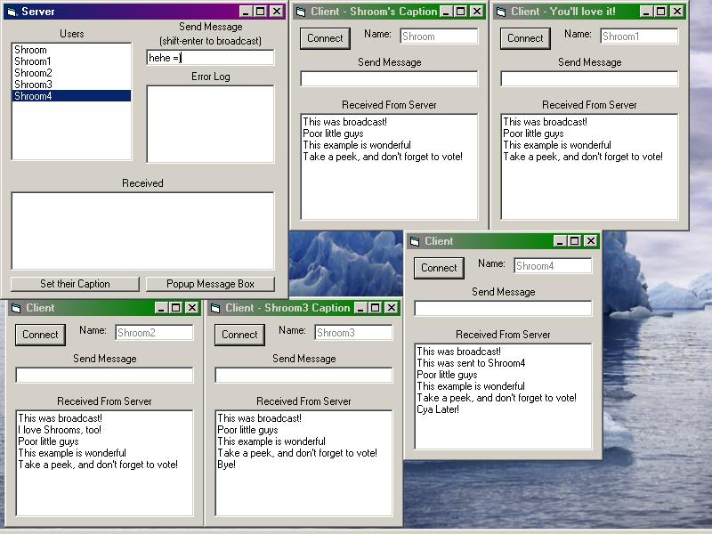



## Accept Multiple Connections With Winsock\! Make your own server\! \( TCP / IP \!\!\! \)

### Description

Allows you to accept multiple winsock connections! Great for beginners to intermediate! I know, still some bugs, but overall some nice coding. Uses TCP/IP connection, not UDP! Take a look, comments up the wazoo on this one =) 

This would be wonderful if you want to create your own gaming server, chat server, or just a file server!  

PS - Guess what, guys?! In my code, when the server "broadcasts" a message, I have a doevents in the loop. This is because of a problem with the winsock control that the doevents fixes. HOWEVER! Service pack 4 fixes this. So d/l service pack 4 and remove the doevents from the "broadcast" loop, and have instantaneous broadcasting!!!
 
### More Info
 

             |
---                |---
**Submitted On**   |2000-11-19 14:07:54
**By**             |[Shroom](https://github.com/Planet-Source-Code/PSCIndex/blob/master/ByAuthor/shroom.md)
**Level**          |Intermediate
**User Rating**    |4.8 (195 globes from 41 users)
**Compatibility**  |VB 6\.0
**Category**       |[Internet/ HTML](https://github.com/Planet-Source-Code/PSCIndex/blob/master/ByCategory/internet-html__1-34.md)
**World**          |[Visual Basic](https://github.com/Planet-Source-Code/PSCIndex/blob/master/ByWorld/visual-basic.md)
**Archive File**   |[CODE\_UPLOAD1185011192000\.zip](https://github.com/Planet-Source-Code/shroom-accept-multiple-connections-with-winsock-make-your-own-server-tcp-ip__1-12956/archive/master.zip)

